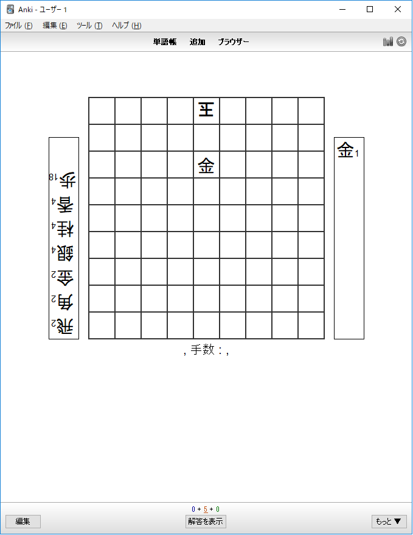
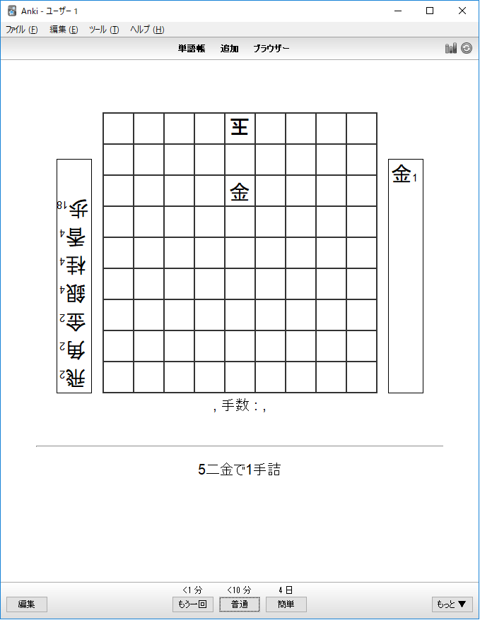

# Anki向け将棋ビジュアライザ

フリーソフトAnkiを用いて将棋の実力向上を手助けするアドオンです。
とくに、自身の対局で現れた次の一手問題を数日後の自身に出題するために有用です。

なお、このツールはWindows上での動作のみ確認しています。

* Ankiとは
Ankiとは単語帳を電子化したようなものです。カードの表面に問題を書き、裏面に答えを書いておき、さらに複数枚のカードを用意すれば、Ankiが適切なタイミングで出題をしてくれます。参考 :  http://rs.luminousspice.com/how-to-anki/

## 外見
1枚目が問題画面、2枚目が問題とその解答を表示した画面になります。

## 導入方法
1. Ankiをインストールし、起動する
2. [ツール] → [アドオン] → [アドオンフォルダを開く]
3. ここにgithubにある shogi_visualization.py を保存する。
4. Ankiを再起動する
5. [ツール] → [アドオン] にshogi_visualization があればOK.

## 使いかた
kif形式の局面を用いる場合、編集画面で、
[kif]　と [/kif]
でくくるだけです。

次が記入例になります。
[kif]
後手の持駒：飛二　角二　金二　銀四　桂四　香四　歩十八  
  ９ ８ ７ ６ ５ ４ ３ ２ １  
+---------------------------+  
| ・ ・ ・ ・v玉 ・ ・ ・ ・|一  
| ・ ・ ・ ・ ・ ・ ・ ・ ・|二  
| ・ ・ ・ ・ 金 ・ ・ ・ ・|三  
| ・ ・ ・ ・ ・ ・ ・ ・ ・|四  
| ・ ・ ・ ・ ・ ・ ・ ・ ・|五  
| ・ ・ ・ ・ ・ ・ ・ ・ ・|六  
| ・ ・ ・ ・ ・ ・ ・ ・ ・|七  
| ・ ・ ・ ・ ・ ・ ・ ・ ・|八  
| ・ ・ ・ ・ ・ ・ ・ ・ ・|九  
+---------------------------+  
先手の持駒：金  
先手：  
後手：  
[/kif]  

sfen形式であれば次のようになります。
[sfen]lnsgkgsnl/1r5b1/ppppppppp/9/9/9/PPPPPPPPP/1B5R1/LNSGKGSNL w - 1[/sfen]

## 活用方法
以下は作者が便利だと思った使い方になります。

1. 将棋所をダウンロードし、思考エンジンも好きなものを導入します。
2. 将棋ウォーズなどから自己対局の棋譜を取得します
3. 将棋所で棋譜解析をかけます
4. 良くなかった手と、どう考えれば良かったかを分析します
5. [編集] -> [局面コピー(KIF/KI2形式)]を選択します
6. Anki側で[追加]を選択します。
7. 表面に先ほどコピーした局面を貼り付け、前後に[kif], [/kif]を書きます。
8. 裏面に考察した内容を書きます

以上の手順で追加を行うことで、自分が間違えやすいであろう問題を追加することができます。

また、一度追加した問題に対してもう一度解析したくなった場合でも、次の手順で将棋所での解析が可能です。
1. [編集] を押し、kifフォーマットの中身をコピー
2. 将棋所にペースト

